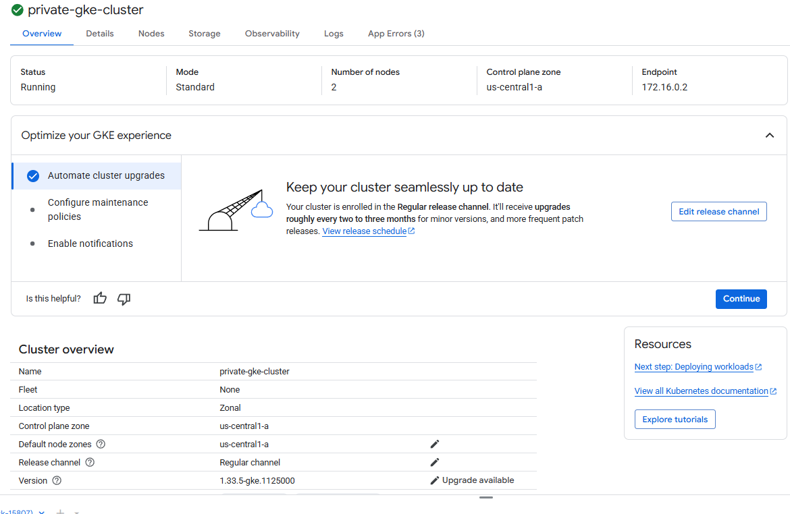
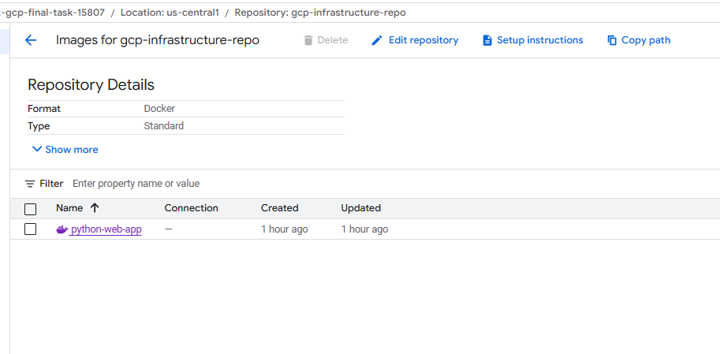
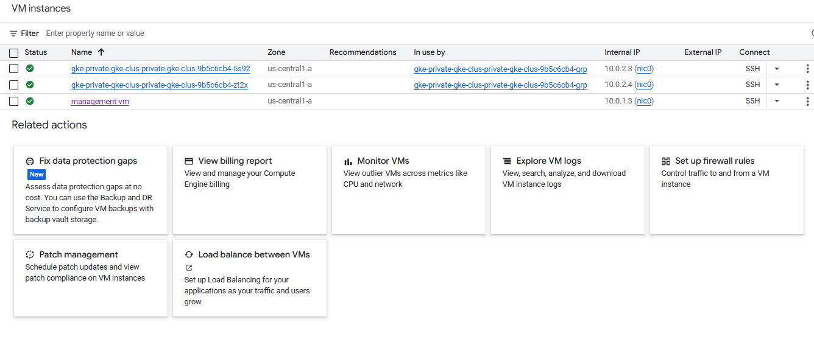
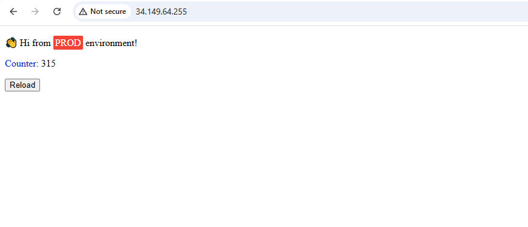

# GCP Infrastructure Deployment with Terraform and GKE

A complete Infrastructure as Code (IaC) solution for deploying a Python web application on Google Cloud Platform using Terraform, Google Kubernetes Engine (GKE), and Redis.

## 📋 Table of Contents

- [Overview](#overview)
- [Architecture](#architecture)
- [Prerequisites](#prerequisites)
- [Project Structure](#project-structure)
- [Quick Start](#quick-start)
- [Deployment Steps](#deployment-steps)
- [Verification](#verification)
- [Cleanup](#cleanup)
- [Troubleshooting](#troubleshooting)

## 🎯 Overview

This project demonstrates a production-ready infrastructure deployment on GCP featuring:

- **Private GKE Cluster** - Secure Kubernetes cluster with private nodes
- **Containerized Python Application** - Flask web app with Redis backend
- **Infrastructure as Code** - Modular Terraform configuration
- **Network Security** - VPC with private subnets, NAT gateway, and firewall rules
- **Management VM** - Bastion host for secure cluster access
- **Container Registry** - Private Google Artifact Registry for Docker images
- **Load Balancing** - HTTP(S) load balancer with external IP

## 🏗️ Architecture

The infrastructure consists of the following components:

```
┌─────────────────────────────────────────────────────────────┐
│                         Internet                             │
└────────────────────────┬────────────────────────────────────┘
                         │
                    ┌────▼────┐
                    │   LB    │ (34.149.64.255)
                    └────┬────┘
                         │
┌────────────────────────┼────────────────────────────────────┐
│                   VPC Network                                │
│  ┌──────────────────┐ │ ┌────────────────────────────────┐ │
│  │ Management Subnet│ │ │   Restricted Subnet (Private)  │ │
│  │  10.0.1.0/24     │ │ │      10.0.2.0/24               │ │
│  │                  │ │ │                                │ │
│  │  ┌────────────┐  │ │ │  ┌──────────────────────────┐ │ │
│  │  │Management  │  │ │ │  │    GKE Cluster           │ │ │
│  │  │    VM      │──┼─┼─┼─▶│  ┌────────┐ ┌─────────┐  │ │ │
│  │  └────────────┘  │ │ │  │  │ Node 1 │ │ Node 2  │  │ │ │
│  │        │         │ │ │  │  └────────┘ └─────────┘  │ │ │
│  │        │         │ │ │  │                          │ │ │
│  │    ┌───▼───┐     │ │ │  │  Pods:                  │ │ │
│  │    │  NAT  │─────┼─┼─┼─▶│  - Python App (x2)      │ │ │
│  │    │Gateway│     │ │ │  │  - Redis StatefulSet    │ │ │
│  │    └───────┘     │ │ │  └──────────────────────────┘ │ │
│  └──────────────────┘ │ └────────────────────────────────┘ │
└───────────────────────┴────────────────────────────────────┘
```

## ✅ Prerequisites

Before you begin, ensure you have:

1. **Google Cloud Platform Account**
   - Active GCP project
   - Billing enabled
   - Sufficient quotas (CPU, disk, IP addresses)

2. **Required Tools**
   - [Terraform](https://www.terraform.io/downloads) (v1.0+)
   - [gcloud CLI](https://cloud.google.com/sdk/docs/install)
   - [kubectl](https://kubernetes.io/docs/tasks/tools/)
   - [Docker](https://docs.docker.com/get-docker/)

3. **GCP Service Account**
   - Service account with appropriate permissions
   - JSON key file downloaded

4. **Required GCP APIs**
   ```bash
   gcloud services enable compute.googleapis.com
   gcloud services enable container.googleapis.com
   gcloud services enable artifactregistry.googleapis.com
   gcloud services enable servicenetworking.googleapis.com
   ```

## 📁 Project Structure

```
.
├── DevOps-Challenge-Demo-Code-master/  # Python application source
│   ├── hello.py                        # Flask application
│   ├── Dockerfile                      # Container image definition
│   ├── requirements.txt                # Python dependencies
│   └── templates/                      # HTML templates
├── terraform/                          # Infrastructure as Code
│   ├── main.tf                         # Root module
│   ├── variables.tf                    # Input variables
│   ├── outputs.tf                      # Output values
│   ├── locals.tf                       # Local values
│   ├── provider.tf                     # Provider configuration
│   ├── modules/                        # Terraform modules
│   │   ├── iam/                        # IAM and service accounts
│   │   ├── networking/                 # VPC, subnets, firewall
│   │   ├── compute/                    # Management VM
│   │   ├── gke/                        # GKE cluster
│   │   └── registry/                   # Artifact Registry
│   └── kubernetes/                     # Kubernetes manifests
│       ├── redis-statefulset.yaml      # Redis deployment
│       ├── app-deployment.yaml         # Application deployment
│       └── ingress.yaml                # Load balancer config
├── images/                             # Documentation screenshots
└── README.md                           # This file
```

## 🚀 Quick Start

### 1. Clone the Repository

```bash
git clone <repository-url>
cd <project-directory>
```

### 2. Configure GCP Credentials

```bash
# Authenticate with GCP
gcloud auth login
gcloud config set project YOUR_PROJECT_ID

# Place your service account key
cp /path/to/service-account-key.json terraform/
```

### 3. Update Terraform Variables

Edit `terraform/terraform.tfvars`:

```hcl
project_id = "your-project-id"
region     = "us-central1"
```

### 4. Deploy Infrastructure

```bash
cd terraform
terraform init
terraform plan
terraform apply
```

### 5. Build and Push Docker Image

```bash
# Configure Docker for Artifact Registry
gcloud auth configure-docker us-central1-docker.pkg.dev

# Build and push the image
cd ../DevOps-Challenge-Demo-Code-master
docker build -t us-central1-docker.pkg.dev/YOUR_PROJECT_ID/gcp-infrastructure-repo/python-web-app:latest .
docker push us-central1-docker.pkg.dev/YOUR_PROJECT_ID/gcp-infrastructure-repo/python-web-app:latest
```

### 6. Deploy to Kubernetes

```bash
# SSH into management VM
gcloud compute ssh management-vm --zone=us-central1-a

# Configure kubectl
gcloud container clusters get-credentials private-gke-cluster \
    --zone=us-central1-a \
    --internal-ip

# Deploy application
kubectl apply -f redis-statefulset.yaml
kubectl apply -f app-deployment.yaml
kubectl apply -f ingress.yaml
```

## 📝 Deployment Steps

### Step 1: Enable Required GCP APIs

```bash
gcloud services enable compute.googleapis.com
gcloud services enable container.googleapis.com
gcloud services enable artifactregistry.googleapis.com
gcloud services enable servicenetworking.googleapis.com
```

### Step 2: Configure Terraform Variables

Edit `terraform/terraform.tfvars` with your project details:

```hcl
project_id = "your-project-id"
region     = "us-central1"
```

### Step 3: Initialize and Apply Terraform

```bash
cd terraform
terraform init
terraform plan
terraform apply
```

This will create:
- VPC with management and restricted subnets
- Cloud NAT gateway
- Firewall rules
- Private GKE cluster
- Management VM
- Google Artifact Registry

### Step 4: Build and Push Docker Image

```bash
# Configure Docker authentication
gcloud auth configure-docker us-central1-docker.pkg.dev

# Navigate to application directory
cd ../DevOps-Challenge-Demo-Code-master

# Build the Docker image
docker build -t us-central1-docker.pkg.dev/YOUR_PROJECT_ID/gcp-infrastructure-repo/python-web-app:latest .

# Push to Artifact Registry
docker push us-central1-docker.pkg.dev/YOUR_PROJECT_ID/gcp-infrastructure-repo/python-web-app:latest
```

### Step 5: Access Management VM

```bash
# SSH into the management VM
gcloud compute ssh management-vm --zone=us-central1-a

# Configure kubectl to access the private cluster
gcloud container clusters get-credentials private-gke-cluster \
    --zone=us-central1-a \
    --internal-ip
```

### Step 6: Deploy Kubernetes Resources

```bash
# Deploy Redis StatefulSet
kubectl apply -f redis-statefulset.yaml

# Deploy Python application
kubectl apply -f app-deployment.yaml

# Deploy Ingress for load balancer
kubectl apply -f ingress.yaml
```

### Step 7: Wait for Load Balancer Provisioning

```bash
# Monitor ingress status (takes 5-10 minutes)
kubectl get ingress python-web-app-ingress -w

# Check detailed status
kubectl describe ingress python-web-app-ingress
```

### Step 8: Access the Application

```bash
# Get the external IP address
kubectl get ingress python-web-app-ingress

# Test the application
curl http://<EXTERNAL-IP>
```

## ✔️ Verification

### Check Infrastructure

```bash
# Verify Terraform resources
cd terraform
terraform show

# Check GCP resources
gcloud compute instances list
gcloud container clusters list
gcloud artifacts repositories list
```

### Check Kubernetes Resources

```bash
# SSH into management VM
gcloud compute ssh management-vm --zone=us-central1-a

# Check all pods
kubectl get pods --all-namespaces

# Check services
kubectl get svc

# Check ingress
kubectl get ingress
```

### Access the Application

Once the load balancer is provisioned, access your application:

```bash
# Get the external IP
kubectl get ingress python-web-app-ingress

# Test the application
curl http://<EXTERNAL-IP>
```

## 📊 Results

### GKE Cluster



### Private Artifact Registry



### Management VM - Cluster Resources


### Management VM - Worker Nodes



### Web Application



## 🧹 Cleanup

To avoid incurring charges, destroy all resources:

```bash
# Delete Kubernetes resources
kubectl delete -f ingress.yaml
kubectl delete -f app-deployment.yaml
kubectl delete -f redis-statefulset.yaml

# Destroy Terraform infrastructure
cd terraform
terraform destroy
```

## 🔧 Troubleshooting

### Issue: Pods Pending Due to Insufficient Resources

**Symptom**: Pods stuck in `Pending` state with "Insufficient cpu" error

**Solution**: Scale down replicas or increase node count

```bash
# Option 1: Scale down to 1 replica
kubectl scale deployment python-web-app --replicas=1

# Option 2: Increase node count in terraform/variables.tf
# Then run: terraform apply
```

### Issue: Ingress Not Getting External IP

**Symptom**: Ingress ADDRESS field remains empty

**Solution**: Ensure service type is NodePort or LoadBalancer

```bash
# Check service type
kubectl get svc python-web-app-service

# If ClusterIP, update to NodePort in app-deployment.yaml
# Then apply: kubectl apply -f app-deployment.yaml
```


### Issue: Docker Push Fails

**Symptom**: Authentication error when pushing to Artifact Registry

**Solution**: Configure Docker authentication

```bash
gcloud auth configure-docker us-central1-docker.pkg.dev
gcloud auth print-access-token | docker login -u oauth2accesstoken \
    --password-stdin https://us-central1-docker.pkg.dev
```


